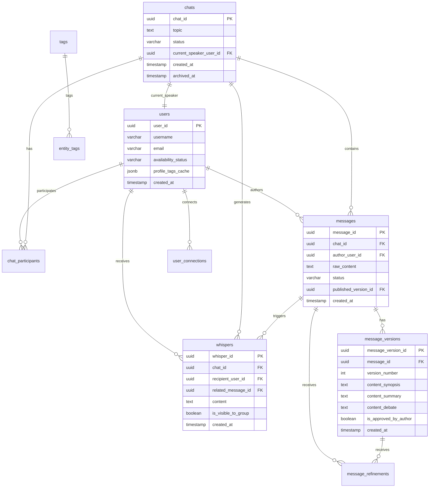

# Database Schema - EmoLab

## Diagrama ER



---

## Tabelas

### 1. users

Perfis dos utilizadores.

```sql
CREATE TABLE users (
  user_id UUID PRIMARY KEY DEFAULT gen_random_uuid(),
  username VARCHAR(100),
  email VARCHAR(255) UNIQUE,
  availability_status VARCHAR(50) DEFAULT 'available',
  profile_tags_cache JSONB,
  created_at TIMESTAMP DEFAULT now()
);
```

**Campos:**
- `user_id`: ID único (UUID)
- `username`: Nome de exibição
- `email`: Email (único, login)
- `availability_status`: 'available', 'processing', 'offline' (BR-E04)
- `profile_tags_cache`: Cache JSON para Perfil Alquímico (BR-F01)
- `created_at`: Data de criação

**RLS:**
- SELECT: Todos podem ver
- UPDATE: Apenas próprio perfil

---

### 2. chats

Sessões de laboratório.

```sql
CREATE TABLE chats (
  chat_id UUID PRIMARY KEY DEFAULT gen_random_uuid(),
  topic TEXT NOT NULL,
  status VARCHAR(50) DEFAULT 'active',
  current_speaker_user_id UUID REFERENCES users(user_id),
  created_at TIMESTAMP DEFAULT now(),
  archived_at TIMESTAMP
);
```

**Campos:**
- `chat_id`: ID único
- `topic`: Tema Alvo da sessão (BR-A01)
- `status`: 'active', 'archived', 'paused'
- `current_speaker_user_id`: Quem tem o microfone (BR-A02)
- `created_at`: Data de início
- `archived_at`: Quando foi arquivado (aciona BR-F02)

**RLS:**
- SELECT: Apenas participantes do chat
- UPDATE: Apenas participantes (para microfone)

---

### 3. chat_participants

Relação User ↔ Chat.

```sql
CREATE TABLE chat_participants (
  chat_participant_id UUID PRIMARY KEY DEFAULT gen_random_uuid(),
  chat_id UUID REFERENCES chats(chat_id) ON DELETE CASCADE,
  user_id UUID REFERENCES users(user_id) ON DELETE CASCADE,
  joined_at TIMESTAMP DEFAULT now(),
  UNIQUE(chat_id, user_id)
);
```

**Campos:**
- `chat_participant_id`: ID único
- `chat_id`: Chat
- `user_id`: Utilizador
- `joined_at`: Quando entrou

**RLS:**
- SELECT: Apenas participantes do chat

---

### 4. messages

Mensagens "mãe" (invólucro).

```sql
CREATE TABLE messages (
  message_id UUID PRIMARY KEY DEFAULT gen_random_uuid(),
  chat_id UUID REFERENCES chats(chat_id) ON DELETE CASCADE,
  author_user_id UUID REFERENCES users(user_id),
  raw_content TEXT NOT NULL,
  status VARCHAR(50) DEFAULT 'pending_review',
  published_version_id UUID,
  created_at TIMESTAMP DEFAULT now()
);
```

**Campos:**
- `message_id`: ID único
- `chat_id`: Chat
- `author_user_id`: Autor
- `raw_content`: Mensagem bruta (BR-B01)
- `status`: 'pending_review', 'published'
- `published_version_id`: Versão aprovada (BR-B06)
- `created_at`: Data de submissão

**RLS:**
- SELECT: Apenas participantes do chat
- INSERT: Apenas participantes do chat

---

### 5. message_versions

Destilações (3 níveis).

```sql
CREATE TABLE message_versions (
  message_version_id UUID PRIMARY KEY DEFAULT gen_random_uuid(),
  message_id UUID REFERENCES messages(message_id) ON DELETE CASCADE,
  version_number INT NOT NULL,
  content_synopsis TEXT NOT NULL,
  content_summary TEXT NOT NULL,
  content_debate TEXT NOT NULL,
  is_approved_by_author BOOLEAN DEFAULT false,
  created_at TIMESTAMP DEFAULT now(),
  UNIQUE(message_id, version_number)
);
```

**Campos:**
- `message_version_id`: ID único
- `message_id`: Mensagem mãe
- `version_number`: 1, 2, 3... (iterações)
- `content_synopsis`: Sinopse (Espírito) (BR-B02)
- `content_summary`: Resumo (Corpo) (BR-B02)
- `content_debate`: Debate (Sal) (BR-B02)
- `is_approved_by_author`: Se foi aprovado (BR-B03)
- `created_at`: Data de geração

**RLS:**
- SELECT: Autor + participantes (se publicado)

---

### 6. message_refinements

Comentários de refinamento.

```sql
CREATE TABLE message_refinements (
  refinement_id UUID PRIMARY KEY DEFAULT gen_random_uuid(),
  message_version_id UUID REFERENCES message_versions(message_version_id) ON DELETE CASCADE,
  author_user_id UUID REFERENCES users(user_id),
  comment_text TEXT NOT NULL,
  selected_text TEXT,
  created_at TIMESTAMP DEFAULT now()
);
```

**Campos:**
- `refinement_id`: ID único
- `message_version_id`: Versão a refinar
- `author_user_id`: Autor (validação)
- `comment_text`: Comentário (BR-B04)
- `selected_text`: Trecho selecionado (NULL se geral)
- `created_at`: Data

**RLS:**
- SELECT: Apenas autor
- INSERT: Apenas autor

---

### 7. whispers

Sussurros privados da IA.

```sql
CREATE TABLE whispers (
  whisper_id UUID PRIMARY KEY DEFAULT gen_random_uuid(),
  chat_id UUID REFERENCES chats(chat_id) ON DELETE CASCADE,
  recipient_user_id UUID REFERENCES users(user_id),
  related_message_id UUID REFERENCES messages(message_id),
  content TEXT NOT NULL,
  is_visible_to_group BOOLEAN DEFAULT false,
  created_at TIMESTAMP DEFAULT now()
);
```

**Campos:**
- `whisper_id`: ID único
- `chat_id`: Chat
- `recipient_user_id`: Destinatário (BR-D01)
- `related_message_id`: Mensagem que gerou o sussurro
- `content`: Texto do sussurro
- `is_visible_to_group`: false (privado) ou true (revelado) (BR-D03)
- `created_at`: Data

**RLS:**
- SELECT: Destinatário OU (is_visible_to_group=true AND participante)

---

### 8. user_connections

Contactos e bloqueios.

```sql
CREATE TABLE user_connections (
  connection_id UUID PRIMARY KEY DEFAULT gen_random_uuid(),
  requester_user_id UUID REFERENCES users(user_id) ON DELETE CASCADE,
  recipient_user_id UUID REFERENCES users(user_id) ON DELETE CASCADE,
  status VARCHAR(50) DEFAULT 'pending',
  created_at TIMESTAMP DEFAULT now(),
  updated_at TIMESTAMP DEFAULT now(),
  UNIQUE(requester_user_id, recipient_user_id)
);
```

**Campos:**
- `connection_id`: ID único
- `requester_user_id`: Quem pediu
- `recipient_user_id`: Quem recebeu
- `status`: 'pending', 'accepted', 'blocked' (BR-E01, BR-E02)
- `created_at`: Data do pedido
- `updated_at`: Última atualização

**RLS:**
- SELECT: Ambas as partes
- INSERT: Qualquer utilizador autenticado
- UPDATE: Destinatário (para aceitar)

---

### 9. tags

Dicionário de tags.

```sql
CREATE TABLE tags (
  tag_id UUID PRIMARY KEY DEFAULT gen_random_uuid(),
  tag_name VARCHAR(255) UNIQUE NOT NULL,
  description TEXT,
  type VARCHAR(100),
  created_at TIMESTAMP DEFAULT now()
);
```

**Campos:**
- `tag_id`: ID único
- `tag_name`: Nome (ex: "[Necessidade:Respeito]")
- `description`: Significado profundo
- `type`: 'Necessidade', 'Valor', 'Padrão', 'Emoção'
- `created_at`: Data de criação

**RLS:**
- SELECT: Todos
- INSERT: Sistema (IA)

---

### 10. entity_tags

Relação polimórfica Tag ↔ Entidade.

```sql
CREATE TABLE entity_tags (
  entity_tag_id UUID PRIMARY KEY DEFAULT gen_random_uuid(),
  tag_id UUID REFERENCES tags(tag_id) ON DELETE CASCADE,
  entity_id UUID NOT NULL,
  entity_type VARCHAR(50) NOT NULL,
  created_by VARCHAR(50),
  created_at TIMESTAMP DEFAULT now()
);

CREATE INDEX idx_entity_tags_entity ON entity_tags(entity_id, entity_type);
```

**Campos:**
- `entity_tag_id`: ID único
- `tag_id`: Tag
- `entity_id`: ID da entidade (user_id, message_id, etc.)
- `entity_type`: 'User', 'Message', 'Chat', etc.
- `created_by`: 'AI' ou 'User' (BR-C04)
- `created_at`: Data

**RLS:**
- SELECT: Complexo (depende da entidade)

---

### 11. microphone_requests

Fila de pedidos de microfone.

```sql
CREATE TABLE microphone_requests (
  mic_request_id UUID PRIMARY KEY DEFAULT gen_random_uuid(),
  chat_id UUID REFERENCES chats(chat_id) ON DELETE CASCADE,
  user_id UUID REFERENCES users(user_id),
  request_time TIMESTAMP DEFAULT now(),
  status VARCHAR(50) DEFAULT 'pending'
);
```

**Campos:**
- `mic_request_id`: ID único
- `chat_id`: Chat
- `user_id`: Quem pediu
- `request_time`: Hora do pedido
- `status`: 'pending', 'fulfilled', 'skipped'

**RLS:**
- SELECT: Participantes do chat
- INSERT: Participantes do chat

---

### 12. chat_invitations

Convites para chats.

```sql
CREATE TABLE chat_invitations (
  invitation_id UUID PRIMARY KEY DEFAULT gen_random_uuid(),
  chat_id UUID REFERENCES chats(chat_id) ON DELETE CASCADE,
  inviter_user_id UUID REFERENCES users(user_id),
  recipient_email VARCHAR(255) NOT NULL,
  status VARCHAR(50) DEFAULT 'pending',
  created_at TIMESTAMP DEFAULT now()
);
```

**Campos:**
- `invitation_id`: ID único
- `chat_id`: Chat
- `inviter_user_id`: Quem convidou
- `recipient_email`: Email convidado
- `status`: 'pending', 'accepted', 'declined'
- `created_at`: Data

**RLS:**
- SELECT: Participantes do chat + email convidado

---

## Índices Recomendados

```sql
-- Messages
CREATE INDEX idx_messages_chat_id ON messages(chat_id);
CREATE INDEX idx_messages_status ON messages(status);

-- Whispers
CREATE INDEX idx_whispers_recipient ON whispers(recipient_user_id);
CREATE INDEX idx_whispers_chat ON whispers(chat_id);

-- Entity Tags
CREATE INDEX idx_entity_tags_entity ON entity_tags(entity_id, entity_type);
CREATE INDEX idx_entity_tags_tag ON entity_tags(tag_id);

-- User Connections
CREATE INDEX idx_connections_requester ON user_connections(requester_user_id);
CREATE INDEX idx_connections_recipient ON user_connections(recipient_user_id);
```

---

**Navegação:**
- [← Voltar ao Índice](./README.md)
- [→ Documentação Técnica](./documentacao-tecnica.md)
