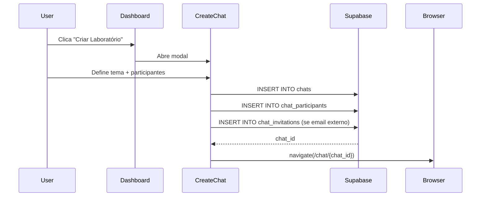
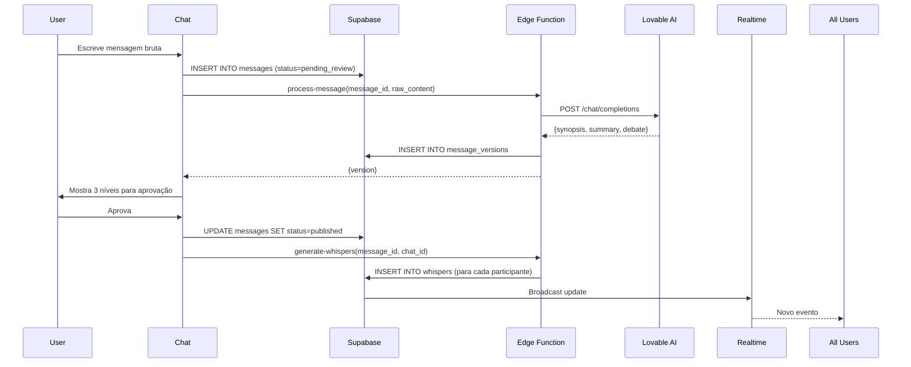
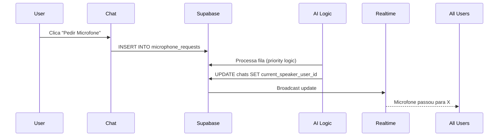

# Documentação Técnica - EmoLab

## 📋 Índice

1. [Visão Geral da Arquitetura](#visão-geral)
2. [Stack Tecnológica](#stack)
3. [Estrutura do Projeto](#estrutura)
4. [Fluxo de Dados](#fluxo-de-dados)
5. [Sistema de Autenticação](#autenticação)
6. [Base de Dados](#base-de-dados)
7. [Edge Functions](#edge-functions)
8. [Integração com IA](#integração-ia)
9. [Segurança e RLS](#segurança)
10. [Performance e Escalabilidade](#performance)

---

## Visão Geral

EmoLab é uma **Single Page Application (SPA)** construída com React + TypeScript, usando Supabase como backend (via Lovable Cloud).

### Arquitetura High-Level

```
┌─────────────┐
│   Client    │ React SPA + TypeScript
│  (Browser)  │ Tailwind CSS + shadcn/ui
└──────┬──────┘
       │ HTTPS
       ▼
┌─────────────┐
│  Supabase   │ Auth + PostgreSQL + Realtime
│   Backend   │ Edge Functions (Deno)
└──────┬──────┘
       │ HTTPS
       ▼
┌─────────────┐
│ Lovable AI  │ Google Gemini 2.5 Flash
│   Gateway   │ OpenAI GPT-5 (backup)
└─────────────┘
```

---

## Stack

### Frontend
- **React 18.3.1** - UI library
- **TypeScript** - Type safety
- **Vite** - Build tool
- **React Router 6.30.1** - Routing
- **Tailwind CSS** - Styling
- **shadcn/ui** - Component library
- **Sonner** - Toast notifications

### Backend (Lovable Cloud / Supabase)
- **PostgreSQL 15** - Database
- **Supabase Auth** - Authentication
- **Supabase Realtime** - WebSocket updates
- **Deno** - Edge Functions runtime

### IA
- **Lovable AI Gateway** - AI proxy
- **Google Gemini 2.5 Flash** - Primary model (destilação)
- **OpenAI GPT-5 Mini** - Backup model

---

## Estrutura

```
emolab/
├── src/
│   ├── components/
│   │   ├── auth/
│   │   │   └── AuthForm.tsx
│   │   └── ui/             # shadcn components
│   ├── pages/
│   │   ├── Index.tsx       # Landing
│   │   ├── Auth.tsx        # Login/Register
│   │   ├── Dashboard.tsx   # Hub
│   │   ├── CreateChat.tsx  # Modal de criação
│   │   ├── Chat.tsx        # Laboratório principal
│   │   └── Contacts.tsx    # Gestão de contactos
│   ├── integrations/
│   │   └── supabase/
│   │       ├── client.ts   # Supabase client
│   │       └── types.ts    # DB types (auto-gerado)
│   ├── hooks/
│   │   ├── use-toast.ts
│   │   └── use-mobile.tsx
│   ├── lib/
│   │   └── utils.ts
│   ├── App.tsx             # Router
│   ├── main.tsx            # Entry point
│   └── index.css           # Global styles + design system
├── supabase/
│   ├── config.toml         # Supabase config
│   ├── functions/
│   │   ├── process-message/
│   │   │   └── index.ts    # Destilação Tripla
│   │   └── generate-whispers/
│   │       └── index.ts    # Geração de sussurros
│   └── migrations/         # SQL migrations (auto-gerado)
├── docs/                   # Documentação
└── public/
```

---

## Fluxo de Dados

### 1. Criação de Chat



### 2. Envio de Mensagem (Destilação)



### 3. Gestão de Microfone



---

## Autenticação

### Configuração

Supabase Auth está configurado com:
- **Auto-confirm email**: `true` (não requer confirmação por email)
- **Signups**: Habilitados
- **Providers**: Email/Password (outros podem ser adicionados)

### Fluxo de Autenticação

```typescript
// Login
const { data, error } = await supabase.auth.signInWithPassword({
  email: 'user@example.com',
  password: 'password123'
});

// Signup
const { data, error } = await supabase.auth.signUp({
  email: 'user@example.com',
  password: 'password123',
  options: {
    data: { username: 'User Name' }
  }
});

// Logout
await supabase.auth.signOut();

// Get current user
const { data: { user } } = await supabase.auth.getUser();
```

### Session Management

- **Persistência**: `localStorage`
- **Auto-refresh**: Habilitado
- **Token**: JWT armazenado automaticamente

---

## Base de Dados

Ver [Database Schema](./database-schema.md) para detalhes completos.

### Tabelas Principais

| Tabela | Propósito |
|--------|-----------|
| `users` | Perfis de utilizadores |
| `chats` | Sessões de laboratório |
| `chat_participants` | Relação User ↔ Chat |
| `messages` | Mensagens "mãe" |
| `message_versions` | Destilações (3 níveis) |
| `message_refinements` | Comentários do autor |
| `whispers` | Sussurros privados da IA |
| `tags` | Dicionário de tags |
| `entity_tags` | Relação polimórfica Tag ↔ Entidade |
| `user_connections` | Contactos/Bloqueios |
| `microphone_requests` | Fila de pedidos |

### Realtime

Tabelas com Realtime habilitado:
- `chats` - Para atualizar current_speaker_user_id
- `messages` - Para novas mensagens
- `whispers` - Para novos sussurros

**Ativar Realtime:**
```sql
ALTER PUBLICATION supabase_realtime ADD TABLE public.messages;
```

---

## Edge Functions

### 1. process-message

**Localização**: `supabase/functions/process-message/index.ts`

**Propósito**: Processar mensagem bruta e gerar destilação tripla.

**Input:**
```typescript
{
  message_id: string,
  raw_content: string,
  version_id?: string,      // Se for refinamento
  refinement?: string       // Comentário do autor
}
```

**Output:**
```typescript
{
  success: true,
  version: {
    message_version_id: string,
    version_number: number,
    content_synopsis: string,
    content_summary: string,
    content_debate: string
  }
}
```

**Prompt para IA:**
```
Você é o Chef Alquimista do EmoLab. Analise esta mensagem e destile-a em 3 níveis:

MENSAGEM BRUTA:
{raw_content}

[Se houver refinamento]
COMENTÁRIO DE REFINAMENTO DO AUTOR:
{refinement}

Responda EXATAMENTE neste formato JSON:
{
  "synopsis": "...",
  "summary": "...",
  "debate": "..."
}
```

### 2. generate-whispers

**Localização**: `supabase/functions/generate-whispers/index.ts`

**Propósito**: Gerar sussurros personalizados para cada participante.

**Input:**
```typescript
{
  message_id: string,
  chat_id: string
}
```

**Lógica:**
1. Busca mensagem + versão publicada
2. Busca todos os participantes (exceto autor)
3. Para cada participante:
   - Gera prompt personalizado
   - Chama Lovable AI
   - Insere sussurro em `whispers`

**Prompt para IA:**
```
Você é o mediador alquímico do EmoLab. {Autor} acabou de publicar:

SINOPSE: {synopsis}
RESUMO: {summary}
DEBATE: {debate}

Crie um "sussurro" para {Participante}, ajudando-o a:
1. Compreender a intenção profunda
2. Identificar possíveis gatilhos emocionais
3. Sugerir perspectiva construtiva

Responda em 2-4 frases, de forma empática.
```

---

## Integração IA

### Lovable AI Gateway

**Endpoint**: `https://ai.gateway.lovable.dev/v1/chat/completions`

**Autenticação**: `Bearer ${LOVABLE_API_KEY}`

**Modelo Padrão**: `google/gemini-2.5-flash`

**Request:**
```typescript
{
  model: "google/gemini-2.5-flash",
  messages: [
    { role: "system", content: "..." },
    { role: "user", content: "..." }
  ],
  temperature: 0.7
}
```

**Response:**
```typescript
{
  choices: [{
    message: {
      content: "..."
    }
  }]
}
```

### Rate Limits

- Limite por workspace
- Erros:
  - `429`: Rate limit excedido
  - `402`: Créditos esgotados

**Handling:**
```typescript
if (!aiResponse.ok) {
  if (aiResponse.status === 429) {
    throw new Error("Rate limits exceeded");
  }
  if (aiResponse.status === 402) {
    throw new Error("Payment required");
  }
}
```

---

## Segurança

### Row Level Security (RLS)

Todas as tabelas têm RLS habilitado.

**Políticas Principais:**

#### users
```sql
-- Ver todos os perfis
CREATE POLICY "Profiles are viewable by everyone"
ON users FOR SELECT USING (true);

-- Atualizar apenas próprio perfil
CREATE POLICY "Users can update own profile"
ON users FOR UPDATE USING (auth.uid() = user_id);
```

#### chats
```sql
-- Ver apenas chats onde participa
CREATE POLICY "Users can view their chats"
ON chats FOR SELECT USING (
  EXISTS (
    SELECT 1 FROM chat_participants
    WHERE chat_id = chats.chat_id
    AND user_id = auth.uid()
  )
);
```

#### whispers
```sql
-- Ver apenas próprios sussurros
CREATE POLICY "Users can view their whispers"
ON whispers FOR SELECT USING (recipient_user_id = auth.uid());

-- Ver sussurros revelados
CREATE POLICY "Anyone can view revealed whispers"
ON whispers FOR SELECT USING (is_visible_to_group = true);
```

### Secrets

Secrets geridos via Lovable Cloud:
- `LOVABLE_API_KEY` - Chave da API Lovable AI (auto-provisionada)
- `SUPABASE_URL` - URL do projeto Supabase
- `SUPABASE_SERVICE_ROLE_KEY` - Para Edge Functions

---

## Performance

### Otimizações

1. **Indices de DB**:
   ```sql
   CREATE INDEX idx_messages_chat_id ON messages(chat_id);
   CREATE INDEX idx_whispers_recipient ON whispers(recipient_user_id);
   CREATE INDEX idx_entity_tags_entity ON entity_tags(entity_id, entity_type);
   ```

2. **Lazy Loading**: Componentes carregados sob demanda

3. **Realtime Seletivo**: Apenas tabelas críticas

4. **Caching**: `profile_tags_cache` em `users`

### Escalabilidade

- **Edge Functions**: Escalam automaticamente
- **Supabase**: Managed PostgreSQL com auto-scaling
- **Lovable AI**: Gateway gerido com balanceamento

---

**Navegação:**
- [← Voltar ao Índice](./README.md)
- [→ Guia de Desenvolvimento](./guia-desenvolvimento.md)
- [→ API Reference](./api-edge-functions.md)
